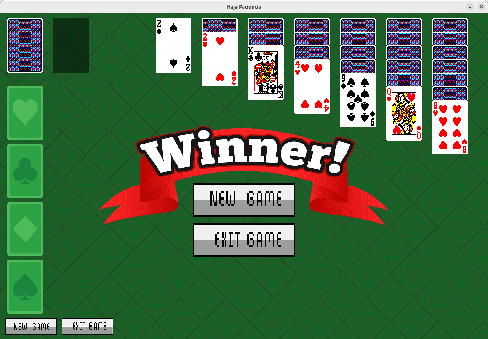
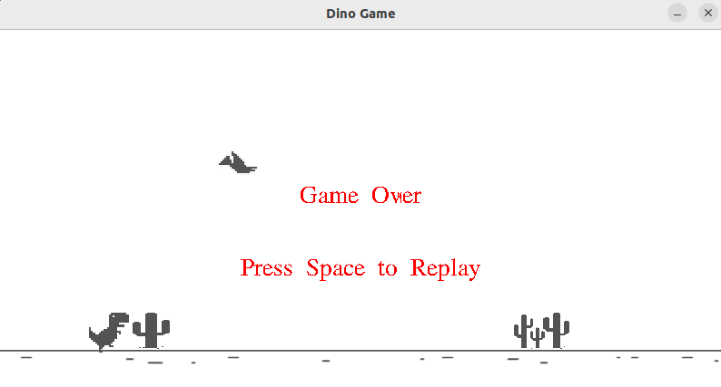
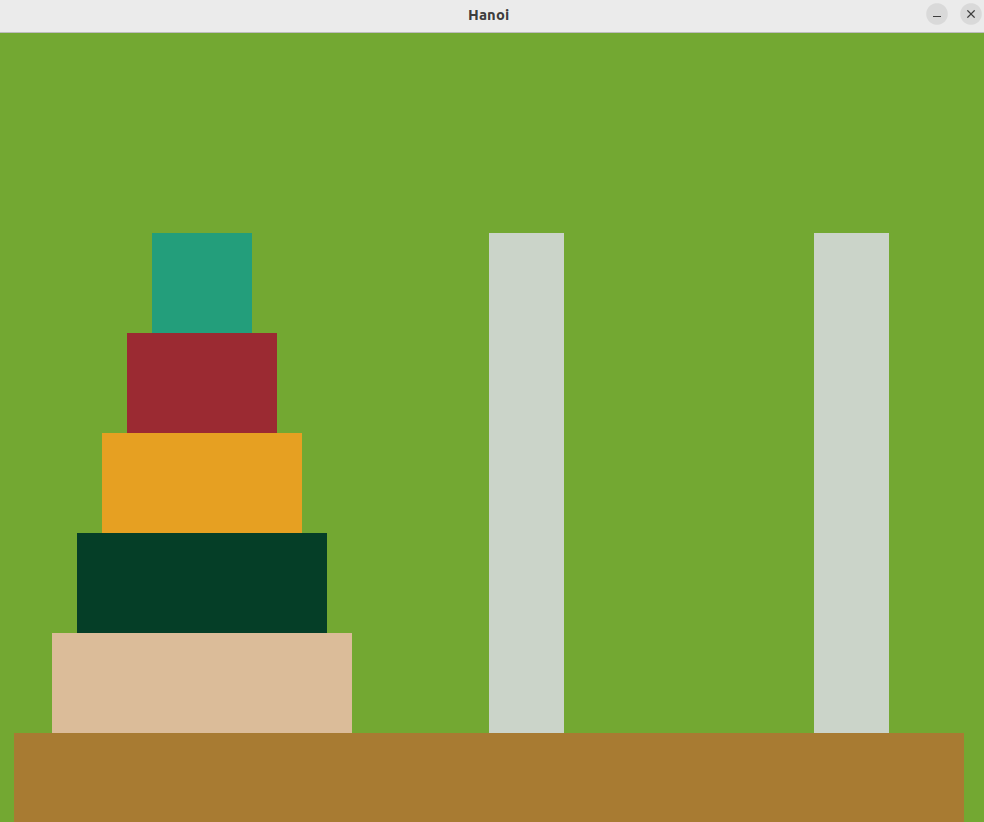
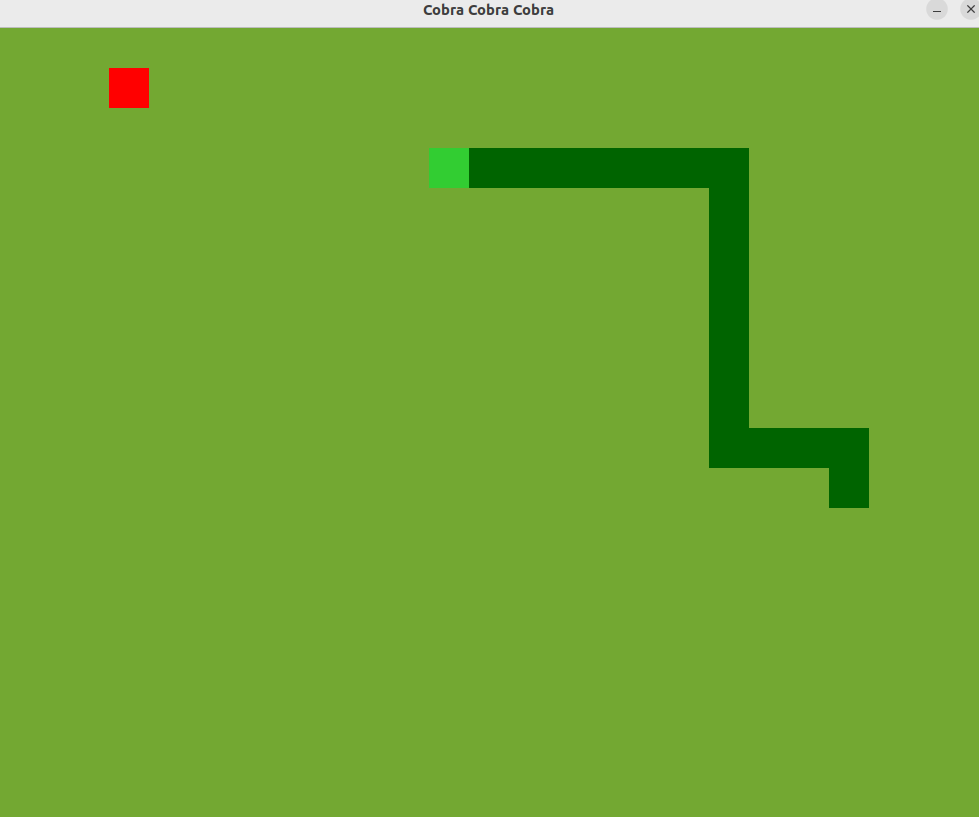
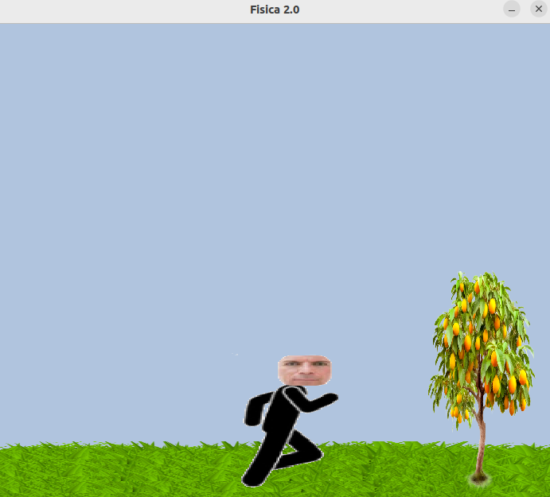

# SDL2
Esse projeto foi desenvolvido com o intuito de aprender, divulgar e ensinar o básico de SDL2, uma biblioteca para interface gráfica nas linguagens C/C++.

## Tecnologias usadas

<div align="center">
  <a href="https://skillicons.dev">
    
    <br>
    
  </a>
</div>

## Para clonar o repositório:
```bash
git clone https://github.com/DaniloLMD/SDL2/
cd SDL2
```


## Imagens de alguns projetos feitos

### Paciência


### Dino Dinosaur Game


### Hanoi


### Snake Game


### Stickman



## 💻 Autores

- [@Danilo](https://github.com/DaniloLMD)
  
